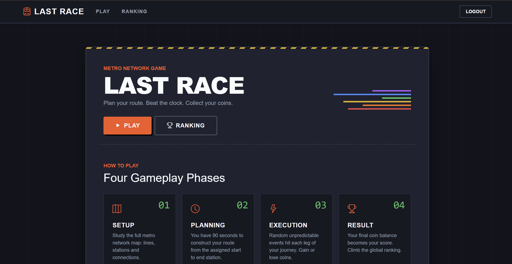
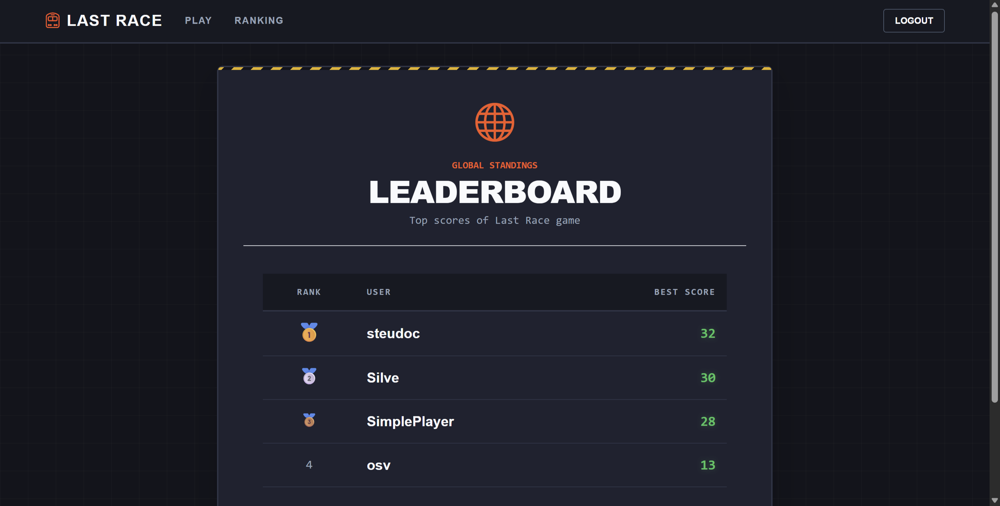
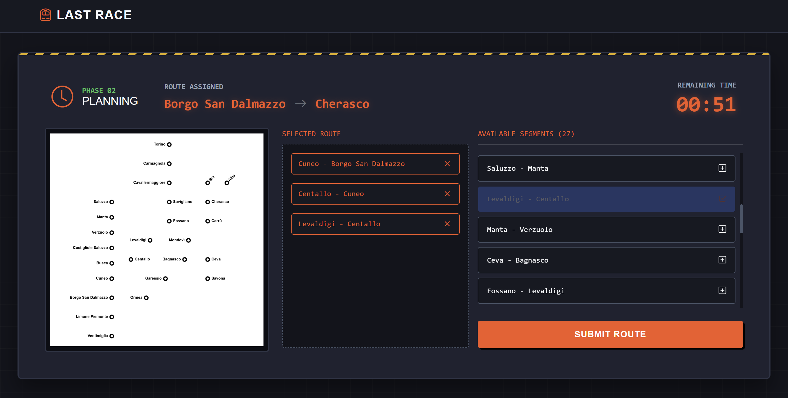

# Last Race


## Description
"Last Race" is a web-based game where players test their memory and luck abilities by guessing the right subway route from start to end station. Each leg of the route is affected by a random event.

## Student: s358440 TALLONE STEFANO 

## React Client Application Routes

- Route `/`: landing page with game instructions, visible to all users (including anonymous). Contains a link to the login page.
- Route `/login`: login form. Redirects to `/` on success.
- Route `/game/setup`: setup phase. Shows the full metro network map with lines, stations and connections. Only accessible to authenticated users, otherwise redirects to `/`.
- Route `/game/plan`: planning phase. The player builds a route from the assigned start to end station within 90 seconds. Only accessible to authenticated users, otherwise redirects to `/`.
- Route `/game/execute`: execution phase. Shows each leg of the journey one at a time, automatically, with its random event and updated coin total. Only accessible to authenticated users, otherwise redirects to `/`.
- Route `/game/result`: result phase. Shows the final score and the option to play again or view the ranking. Only accessible to authenticated users, otherwise redirects to `/`.
- Route `/ranking`: ranking board showing all users and their best score, ordered by best score descending. Only accessible to authenticated users, otherwise redirects to `/`.

## API Server

### Auth
- GET `/api/sessions/current`
  - request parameters: cookie for passport authentication
  - response body: user info associated with current session
  - response status: 
    - 200 OK
    - 401 Unauthorized
    - 500 Internal Server Error
  - response body example (in case of success): 
    ```
    {
      id: 1,
      username: 'steudoc'
    }
- POST `/api/sessions`
  - request parameters: none
  - request body: credentials { username, password }
  - response body: user info associated with the new session
  - response status:
    - 200 OK
    - 401 Unauthorized
    - 500 Internal Server Error
  - response body example (in case of success): 
    ```
    {
      id: 1,
      username: 'steudoc'
    }
- DELETE `/api/sessions/current`
  - request parameters: cookie for passport authentication
  - response body: none,
  - response status: 
    - 200 OK
    - 401 Unauthorized
    - 500 Internal Server Error

### Static data
- GET `/api/lines`
  - request parameters: cookie for passport authentication
  - response body: list of all lines with their ordered stations
  - response status: 
    - 200 OK
    - 401 Unauthorized
    - 500 Internal Server Error
  - response body example (in case of success): 
    ```
    [
      {
        id: 1,
        name: 'Blue Line',
        color: 'blue',
        stations: [
          { id: 1, name: 'Torino', position: 1 },
          { id: 2, name: 'Carmagnola', position: 2 },
          ...
        ]
      },
      ...
    ]
- GET `/api/stations`
  - request parameters: cookie for passport authentication
  - response body: list of all stations
  - response status: 
    - 200 OK
    - 401 Unauthorized
    - 500 Internal Server Error
  - response body example (in case of success): 
    ```
    [
      { id: 1, name: 'Torino' },
      { id: 2, name: 'Carmagnola' },
      ...
    ]
- GET `/api/connections`
  - request parameters: cookie for passport authentication
  - response body: list of all connections (pairs of adjacent stations on the same line)
  - response status: 
    - 200 OK
    - 401 Unauthorized
    - 500 Internal Server Error
  - response body example (in case of success): 
    ```
    [
      {
        fromId: 1,
        fromName: 'Torino',
        toId: 2,
        toName: 'Carmagnola'
      },
      ...
    ]
### Game 
GET `/api/game/start`
  - request parameters: cookie for passport authentication
  - response body: randomly assigned start and end stations (min distance: 3 stops)
  - response status: 
    - 200 OK
    - 401 Unauthorized
    - 500 Internal Server Error
  - response body example (in case of success): 
    ```
    {
      startStation: { id: 3, name: 'Cavallermaggiore' },
      endStation: { id: 9, name: 'Ceva' }
    }
POST `/api/game/execute`
  - request parameters: cookie for passport authentication
  - request body:
    ```
    {
      connections: [
        { fromId: 1, toId: 2 },
        { fromId: 2, toId: 3 },
        ...
      ],
      startId: 1,
      endId: 4,
    }
    ```
  - response body: validation result and, if valid, list of connections with their random events and running coin total; if invalid, score is 0
  - response status: 
    - 200 OK
    - 401 Unauthorized
    - 403 Forbidden
    - 422 Unprocessable Content
    - 500 Internal Server Error
  - response body example (in case of success, valid route): 
    ```
    {
      valid: true,
      finalScore: 17,
      connections: [
        { 
          fromName: 'Cavallermaggiore', 
          toName: 'Savigliano', 
          event: 'Smooth ride', 
          effect: 0, 
          coinsAfter: 20 
        },
        ...
      ]
    }
### Ranking
GET `/api/ranking`
  - request parameters: cookie for passport authentication
  - response body: list of all users with their best score, ordered by best score descending
  - response status:
    - 200 OK
    - 401 Unauthorized
    - 500 Internal Server Error
  - response body example (in case of success): 
    ```
    [
      { username: 'mario.rossi', bestScore: 24 },
      { username: 'luigi.bianchi', bestScore: 18 },
      ...
    ]
    ```


## Database Tables

- Table `lines` - contains lines; identified by id; fields: (id, name, color)
- Table `stations` - contains stations; identified by id; fields: (id, name)
- Table `line_stations` - bridge table used to represent stations inside a specific line; identified by (line_id, station_id); fields: (line_id, station_id, position)
- Table `events` - contains events applied to routes; identified by id; fields: (id, description, effect)
- Table `users` - contains user data; identified by id; fields: (id, username, password (hashed), salt (for hashing a password), best_score)

## Main React Components

- `NavHeader` (in `NavHeader.jsx`): navigation bar shown on all pages, contains links to routes and the login/logout button
- `LoginForm` (in `AuthComponents.jsx`): login form with username and password fields, handles the POST /api/session call and redirects on success
- `Home` (in `Home.jsx`): landing page of the application, introduces the game rules, explains the four gameplay phases, and provides entry points to login or start a new game
- `Map` (in `Map.jsx`): setup page phase, renders the full metro network map with colored lines and connections. Contains the button to start the game
- `GamePlan` (in `GamePlan.jsx`): planning phase, shows the 90-seconds countdown timer, the station-only map, the selectable connections list and the route being built
- `GameExecute` (in `GameExecute&Result.jsx`): execution phase, shows each connection one at a time with its random event and updated coin total
- `GameResult` (in `GameExecute&Result.jsx`): result phase, shows the final score and the buttons to start a new game, see ranking or return to home.
- `Ranking` (in `Ranking.jsx`): ranking page, shows a table with all users and their best score ordered descending

## Screenshot




## Users Credentials

| Username      | Password |
| :------------ | :------- |
| steudoc       | password |
| mario.rossi   | password |
| luigi.bianchi | password |
| osv           | password |
| SimplePlayer  | password |
| john.doe      | password |
| julia         | password |
| Silve         | password |

Note: steudoc, osv, SimplePlayer and Silve have already played more than one game

## Use of AI Tools
I used Gemini mainly for harmonizing the look of the application and apply it consistently across all components. I have also used it to help me identifying and fixing bugs during development.
I wrote the core application logic myself, and used AI as a support tool for styling decisions and debugging specific errors. Especially for error resolution, I verified that every suggestion provided by the AI was correct (by comparing it with course topics or documentation) and that it met best practices. I almost always took inspiration from Gemini's suggestion to develop my own solution that was more suited to the context of my application
